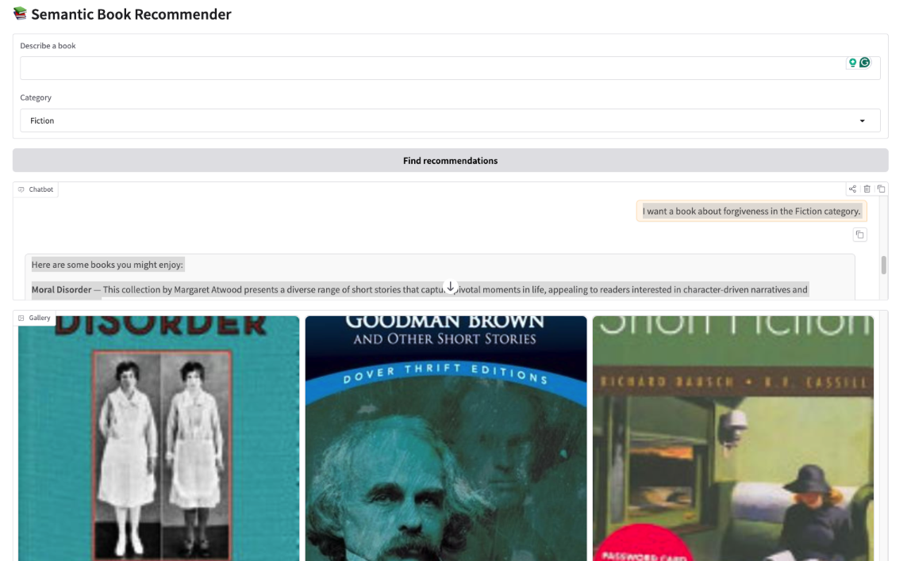

# 📚 Semantic Book Recommender (RAG)

Demo Link : https://huggingface.co/spaces/Isariya/book-recommender-system

An end-to-end **Retrieval-Augmented Generation (RAG)** system that recommends books using **semantic search, query expansion, cross-encoder reranking, and LLM reasoning**.

The system retrieves relevant books from a vector database and uses an LLM to generate personalized recommendations with explanations.

The application includes an interactive **Gradio UI** and is fully **containerized with Docker**.

---

# 🚀 Features

- 🔎 **Semantic Search** using OpenAI embeddings
- 🧠 **Query Expansion with LLM** to improve recall
- ⚡ **Cross-Encoder Reranking** for better ranking quality
- 📚 **Retrieval-Augmented Generation (RAG)** recommendation pipeline
- 🖥 **Interactive UI with Gradio**
- 🐳 **Dockerized deployment**
- 💾 **Persistent Chroma vector database**

---

# 🧠 System Architecture

```
User
 │
 ▼
Gradio UI
 │
 ▼
Query Builder
 │
 ▼
Query Expansion (LLM)
 │
 ▼
Vector Search (Chroma + OpenAI Embeddings)
 │
 ▼
Deduplication + Filter by Category
 │
 ▼
Cross Encoder Reranker (MS MARCO MiniLM)
 │
 ▼
Context Builder
 │
 ▼
LLM Recommendation Generator
 │
 ▼
Book Recommendations + Explanation
```

---

# 📂 Project Structure

```
book-recommender-rag
│
├── app
│   └── gradio_app.py        # Gradio user interface
│
├── rag
│   ├── retriever.py         # Vector database retrieval
│   ├── reranker.py          # Cross-encoder reranking
│   ├── query_expansion.py   # LLM query expansion
│   ├── generator.py         # LLM recommendation generation
│   └── pipeline.py          # End-to-end RAG pipeline
│
├── scripts
│   └── vector_db_build.py   # Build vector database
│
├── utils
│   ├── data_loader.py       # Dataset loading utilities
│   └── query_builder.py     # Query construction
│
├── data
│   ├── books_with_emotions.csv
│   └── tagged_description.txt
│
├── vector_db            # Chroma vector database
│
├── Dockerfile
├── requirements.txt
└── README.md
```

---

# 🧩 RAG Pipeline

The recommendation process follows these steps:

1. **Query Construction**

User inputs are combined into a structured query.

Example:

```
I want a suspenseful mystery book with themes of revenge
```

---

2. **Query Expansion**

An LLM generates multiple alternative queries to improve retrieval recall.

Example:

```
revenge mystery novel
dark suspense thriller
crime novel about revenge
```

---

3. **Vector Retrieval**

Books are retrieved using semantic similarity search.

```
Chroma + OpenAI Embeddings
```

---

4. **Deduplication**

Duplicate documents from multiple queries are removed.

---

5. **Cross-Encoder Reranking**

Candidate books are reranked using:

```
cross-encoder/ms-marco-MiniLM-L-6-v2
```

This improves relevance compared to pure vector similarity.

---

6. **Context Construction**

Metadata and descriptions are assembled into context for the LLM.

Example:

```
Title: Book Title
Author: Author Name
Category: Fiction
Description: ...
```

---

7. **LLM Recommendation**

The LLM selects the **best 3 books** and explains why they match the user query.

Output format:

```json
{
	"books": [
		{
			"title": "...",
			"isbn": "...",
			"reason": "..."
		}
	]
}
```

---

# 🖥 Demo UI

The system includes an interactive **Gradio interface** that allows users to:

- Describe the type of book they want
- Select a category
- Select an emotional tone
- Receive recommendations with explanations

Each recommendation includes:

- Book cover
- Author
- Description preview
- Reason for recommendation

---

# 🛠 Tech Stack

**LLM / AI**

- OpenAI API
- LangChain

**Retrieval**

- Chroma Vector Database
- OpenAI Embeddings

**Ranking**

- Sentence Transformers
- CrossEncoder (MS MARCO)

**Backend**

- Python

**UI**

- Gradio

**Deployment**

- Docker

---

# ⚙️ Installation

## 1️⃣ Clone repository

```
git clone https://github.com/yourname/book-recommender-rag
cd book-recommender-rag
```

---

## 2️⃣ Install dependencies

```
pip install -r requirements.txt
```

---

## 3️⃣ Set environment variables

Create `.env`

```
OPENAI_API_KEY=your_openai_api_key
```

---

# 🧠 Build Vector Database

Run the embedding pipeline once:

```
python scripts/vector_db_build.py
```

This script:

- loads book descriptions
- generates embeddings
- stores them in **Chroma vector DB**

The database is saved in:

```
/vector_db
```

---

# ▶️ Run Application

```
python -m app.gradio_app
```

Open:

```
http://localhost:7860
```

---

# 🐳 Run with Docker

Build image:

```
docker build -t book-recommender .
```

Run container:

```
docker run -p 7860:7860 \
-e OPENAI_API_KEY=your_key \
book-recommender
```

---

# 📌 Key Learning Outcomes

This project demonstrates:

- Building **end-to-end RAG systems**
- Improving retrieval with **query expansion**
- Ranking with **cross-encoder models**
- Designing **modular AI pipelines**
- Deploying AI applications with **Docker**

---

# 👤 Author

Built as a **portfolio project for Applied AI / ML Engineering roles**.

---
